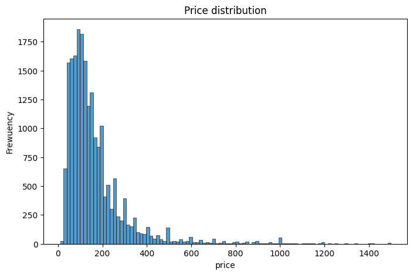
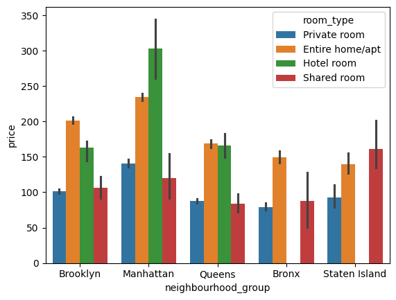
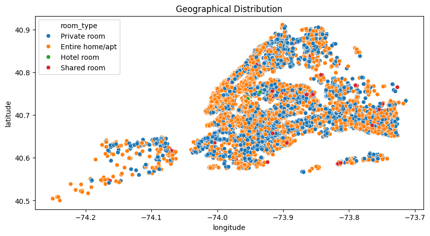
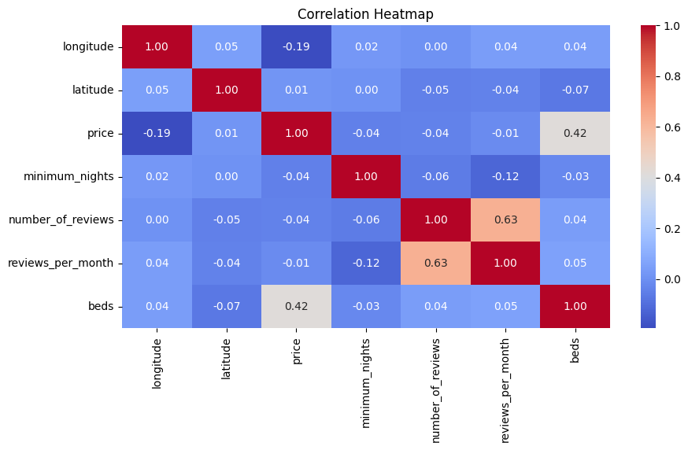

    # New York Airbnb EDA Project with Python
A Data Analytics Resume Project

Introduction
This project involves performing Exploratory Data Analysis (EDA) on a dataset containing Airbnb listings in New York City. The goal is to uncover patterns, trends, and insights that can help understand the dynamics of the Airbnb market. This analysis demonstrates practical data analytics and visualization skills using Python.

The dataset includes information on various aspects of Airbnb listings, such as price, location, availability, and reviews. It is a comprehensive example of using Python for data-driven decision-making.

Abstract
The project begins with importing necessary Python libraries and loading the dataset. It proceeds with essential data cleaning, exploration, and visualization. Key steps include:

Inspecting the dataset for missing values and anomalies.
Performing univariate and bivariate analyses.
Applying feature engineering to prepare data for further analysis.
Creating meaningful visualizations to highlight trends and relationships.
This project provides valuable insights into the Airbnb market and demonstrates proficiency in Python for data analytics, making it an excellent portfolio project.

Details of the Analysis

### **1. Importing Libraries**  

To perform data analysis and visualization, the following libraries were utilized:  
- **Pandas**: For data manipulation and preprocessing.  
- **NumPy**: For numerical computations.  
- **Matplotlib & Seaborn**: For creating compelling visualizations.  

Key libraries and their purpose were explicitly defined at the start of the project to ensure modularity and clarity.  
```python
import pandas as pd
import numpy as np
import matplotlib.pyplot as plt
import seaborn as sns
```

---

### **2. Loading the Dataset**  
The dataset, containing details of Airbnb listings in New York, was loaded into a Pandas DataFrame.  
- Initial rows were inspected using `head()`, and basic dataset dimensions were checked using `shape`.  
- Column names and data types were evaluated to understand the structure of the dataset.  

```python
data = pd.read_csv('airbnbDataSet.csv', encoding_errors='ignore')
data.head(5)  # View the first five rows of the dataset
data.info()   # Get column types and null values
data.describe()  # Statistical summary of numerical columns
```

---

### **3. Data Cleaning**  
Cleaning tasks focused on ensuring data quality and reliability:  
- **Missing Values**: Identified and handled missing data with appropriate techniques such as imputation or dropping irrelevant rows.  
- **Duplicates**: Duplicated rows were detected and removed.  
- **Formatting Issues**: Column names were standardized, and categorical data was encoded where necessary.  
- **Outlier Detection**: Univariate analysis was performed to spot anomalies in features like price and availability.


```python
# Example: Handling missing values
data = data.dropna(subset=['price', 'location'])
```

---

### **4. Data Exploration**  
Exploratory analysis was conducted to uncover key patterns in the data:  
- **Univariate Analysis**: Studied individual features such as price distributions, room types, and neighborhood popularity.  
  - Example: Histograms and boxplots were used to visualize price distribution and detect outliers.  
- **Bivariate Analysis**: Explored relationships between variables, such as how price varies across neighborhoods or room types.  
  - Example: Scatter plots showed the correlation between price and the number of reviews.

```python
# Example: Price distribution
sns.histplot(data['price'], kde=True)
plt.title('Price Distribution')
plt.show()
```

```
#Price Dependency on Neighborhoud
sns.barplot(data = df , x='neighbourhood_group',y = 'price' , hue = 'room_type')
```

```
# Scatter plot: Price vs Number of Reviews
sns.scatterplot(x='price', y='number_of_reviews', data=data)
plt.title('Price vs Reviews')
plt.show()
```

```
corr = df[['longitude', 'latitude', 'price', 'minimum_nights', 'number_of_reviews', 'reviews_per_month', 'beds']]

# Check for NaN and drop rows with missing values
corr = corr.dropna()

# Compute the correlation matrix
corr_matrix = corr.corr()

# Create the heatmap
plt.figure(figsize=(10, 5))
sns.heatmap(data=corr_matrix, annot=True, cmap='coolwarm', fmt=".2f")
plt.title('Correlation Heatmap')
plt.show()
```

```

### **5. Feature Engineering**  
New features were derived to enhance analysis and insights:  
- **Price Categories**: Grouped listings into price ranges (e.g., low, medium, high) for better segmentation.  
- **Availability Trends**: Created new metrics, such as average availability by neighborhood.  
- **Review Activity**: Engineered features to aVssess review dynamics over time.  

```python
# Example: Creating price categories
data['price_category'] = pd.cut(data['price'], bins=[0, 100, 300, 1000], labels=['Low', 'Medium', 'High'])

# ['price per bed'] A NEW COLUNM GOT ADDED
df['price per bed'] = df['price']/df['beds']
```

---

### **6. Visualizations**  
Visual storytelling was central to the project, with an emphasis on creating actionable insights:  
- **Heatmaps**: Visualized correlations among numerical features to identify strong relationships.  
- **Bar Charts**: Compared popularity of room types across neighborhoods.  
- **Scatter Plots**: Analyzed price dynamics across geographic locations.  

```python
# Correlation heatmap
plt.figure(figsize=(10, 8))
sns.heatmap(data.corr(), annot=True, cmap='coolwarm')
plt.title('Correlation Heatmap')
plt.show()

# Room types by neighborhood
sns.countplot(x='neighborhood', hue='room_type', data=data)
plt.title('Room Types by Neighborhood')
plt.xticks(rotation=45)
plt.show()
```

These visualizations significantly aid in deriving actionable insights and communicating findings effectively.

---

### **7. Key Insights Derived**  
Some critical insights uncovered include:  
- Popular neighborhoods and their average prices.  
- Room types most commonly listed.  
- Correlation between price and features such as reviews and availability.  

---
